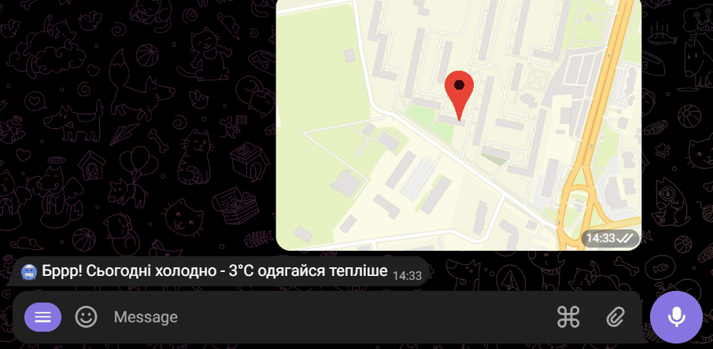
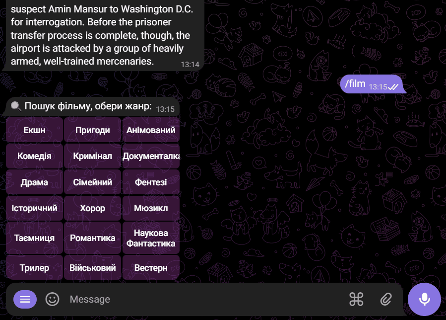
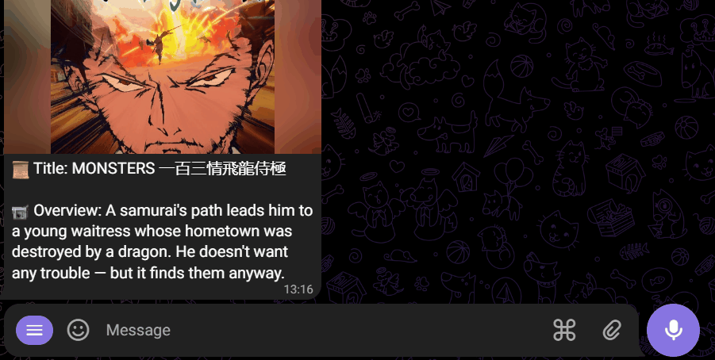

# secret-message - <a href="https://t.me/secretMessageForNastya_bot">link</a> ㊙️
## Telegram bot that takes care of you, able to find you a film and motivate you through the day 🤖

General list of commands and description:
```
/start - starts the bot and sends button which will generate random
message and will send 2 messages daily at the fixed time (11:00 and 16:00 by Kyiv);
/film - will find you random film by the selected genre;
/care - the bot will take care of you and send the weather every morning at 8 AM by Kyiv (geolocation needed);
/info - general info about bot commands /start /film /care and /users;
/users - calculates the current users amount of the bot;
```

🚀 **/start command:**



🎥 **/film command:**



🧑‍🤝‍🧑 **/users command:**



> **Technologies**:
> *Node.js,
> Telegram bot API,
> Axios,
> Heroku Scheduler,
> OpenWeatherMap API,
> TMDB API,
> PostgreSQL,
> Pg-Promise*

Have fun, drive fast, leave the *Matrix* 🙂💻

P.S. In case of any questions, you may reach developer at @camelCasingg 📫
